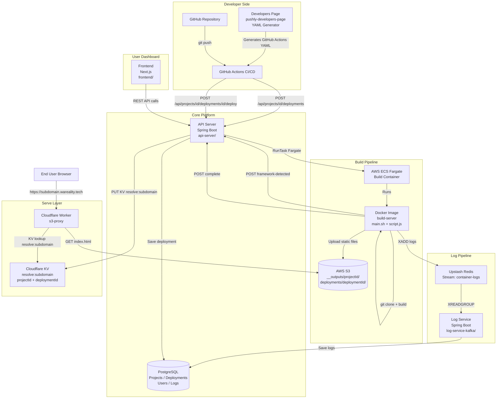
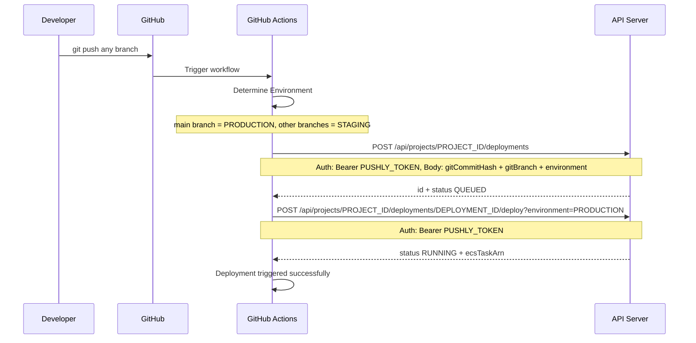
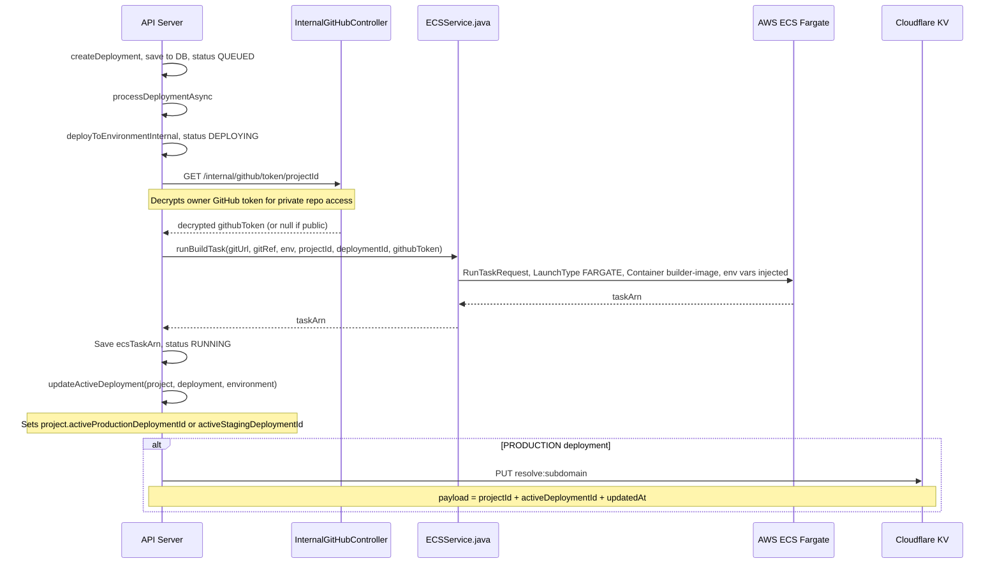
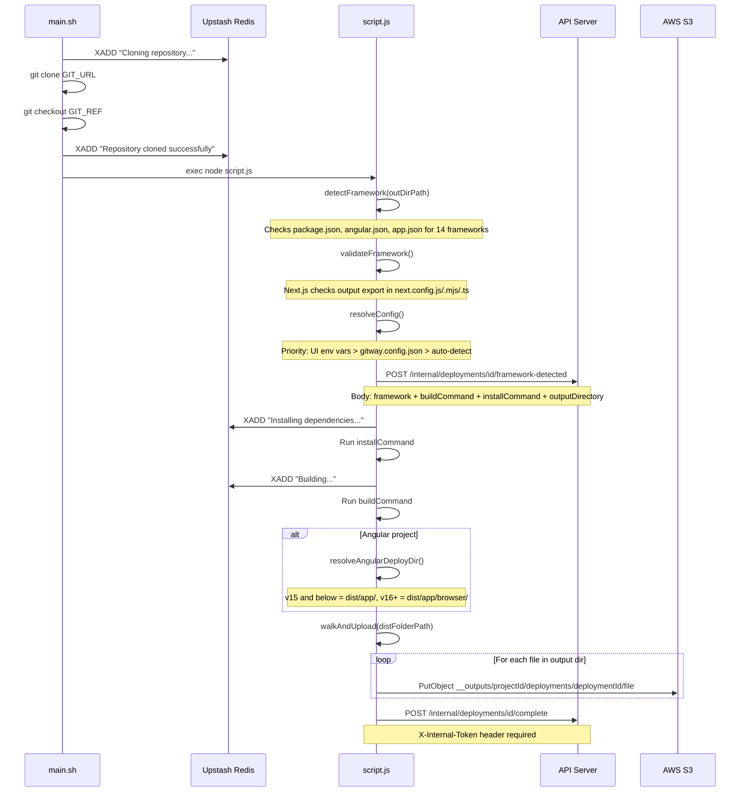
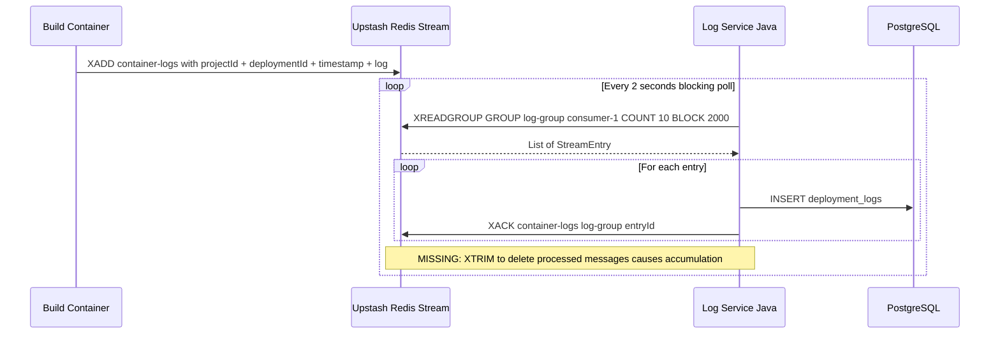
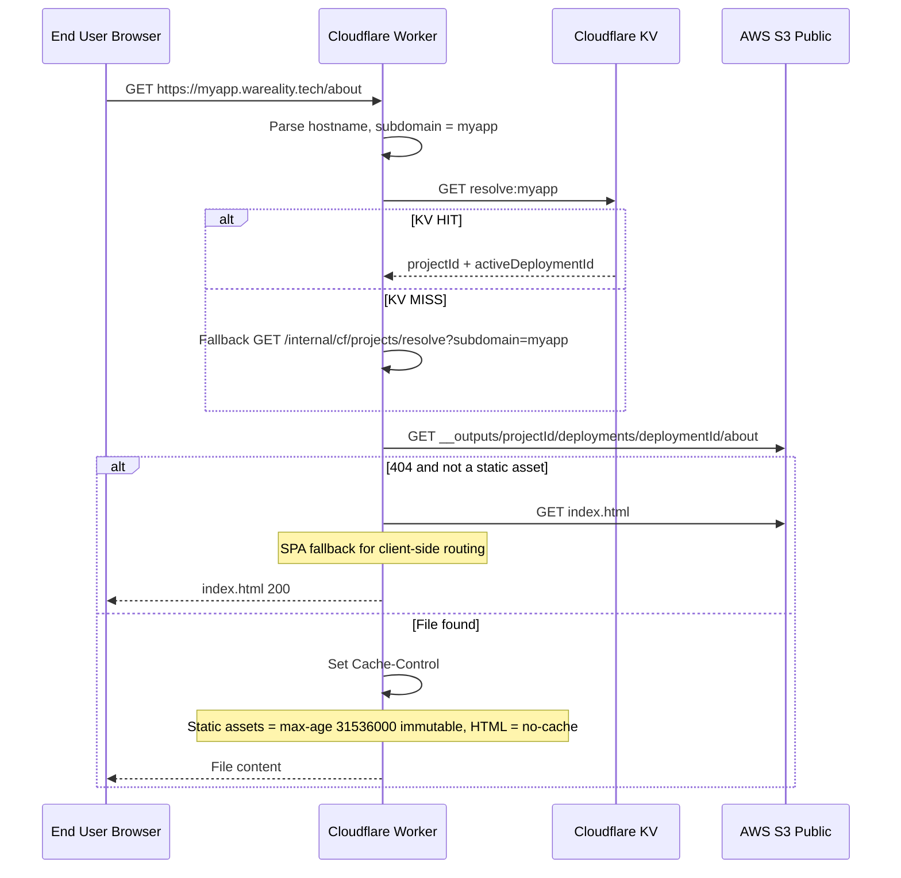
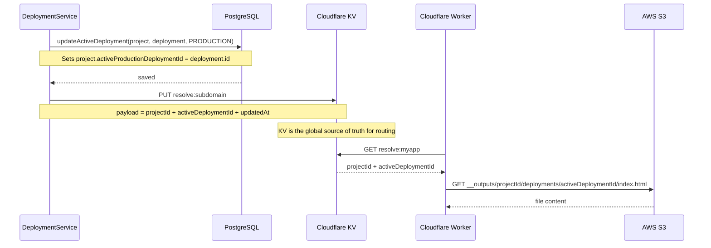

# Pushly — Full System Design

> **Pushly** is a static frontend deployment platform (like Vercel/Netlify).
> Users push code → GitHub Actions triggers a build → files land on S3 → served via Cloudflare Worker.

---

## High-Level Architecture



---

## Complete Flow: Push to Build to Deploy to Serve

### Phase 1: CI/CD Trigger (GitHub Actions)



**GitHub Secrets Required:**

| Secret | Value |
|--------|-------|
| `PROJECT_ID` | Your Pushly project ID |
| `PUSHLY_TOKEN` | JWT token from Pushly dashboard |
| `SLACK_WEBHOOK_URL` | (Optional) Slack notifications |

---

### Phase 2: API Server to ECS Trigger



**ECS Environment Variables Injected:**

```
GIT_URL          = project.gitURL
GIT_REF          = deployment.gitBranch
ENV              = PRODUCTION or STAGING
PROJECT_ID       = project.id
DEPLOYMENT_ID    = deployment.id
INTERNAL_TOKEN   = INTERNAL_PROXY_TOKEN secret
API_URL          = https://api.wareality.tech
GITHUB_TOKEN     = encrypted token (private repos only)
```

---

### Phase 3: Build Container Execution



---

### Phase 4: Log Pipeline



> **Issue:** `XACK` marks as read but does NOT delete. Add `jedis.xtrim(streamKey, 1000, true)` after each batch.

---

### Phase 5: Serve Flow (End User)



**URL Formats:**

| Environment | URL Pattern |
|------------|-------------|
| Production | `https://{subdomain}.wareality.tech` |
| Staging | `https://{deploymentId}--{subdomain}.wareality.tech` |

---

## Key API Endpoints

### Public API — JWT Auth Required

| Method | Endpoint | Description |
|--------|----------|-------------|
| `POST` | `/api/auth/login` | Login, returns JWT token |
| `POST` | `/api/auth/register` | Register new user |
| `POST` | `/api/projects` | Create project |
| `GET` | `/api/projects` | List user projects |
| `GET` | `/api/projects/{id}` | Get project details |
| `POST` | `/api/projects/{id}/deployments` | Create deployment (step 1) |
| `POST` | `/api/projects/{id}/deployments/{id}/deploy` | Trigger build (step 2) |
| `GET` | `/api/projects/{id}/deployments` | List deployments paginated |
| `GET` | `/api/projects/{id}/deployments/{id}` | Get deployment details |
| `POST` | `/api/projects/{id}/deployments/{id}/promote` | Promote staging to production |
| `POST` | `/api/projects/{id}/deployments/{id}/rollback` | Rollback to previous |
| `POST` | `/api/projects/{id}/deployments/{id}/stop` | Stop running ECS task |
| `DELETE` | `/api/projects/{id}/deployments/{id}` | Delete deployment |
| `GET` | `/api/projects/{id}/deployments/active` | Get active deployments per env |

### Internal API — X-Internal-Token Required

#### InternalDeploymentController — called by Build Server (ECS)

| Method | Endpoint | Request Body | Response |
|--------|----------|-------------|----------|
| `POST` | `/internal/deployments/{id}/complete` | none | `{ success, deploymentId, status }` |
| `POST` | `/internal/deployments/{id}/failed` | `{ error: "message" }` | `{ success, deploymentId, status }` |
| `POST` | `/internal/deployments/{id}/framework-detected` | `{ framework, buildCommand, installCommand, outputDirectory }` | `{ success, deploymentId, framework }` |

#### InternalCloudFlareController — called by Cloudflare Worker (KV miss fallback)

| Method | Endpoint | Response |
|--------|----------|----------|
| `GET` | `/internal/cf/projects/resolve?subdomain=X` | `{ projectId, activeDeploymentId, updatedAt }` from Cloudflare KV |

> **Note:** This is a KV passthrough — the API reads from Cloudflare KV and returns it. The Worker calls this only on a KV miss.

#### InternalGitHubController — called internally by DeploymentService

| Method | Endpoint | Response |
|--------|----------|----------|
| `GET` | `/internal/github/token/{projectId}` | `{ token: "decrypted_github_token" }` |

> Decrypts the owner's AES-encrypted GitHub access token stored in the User record. Returns 404 if GitHub not connected.

#### InternalProjectController — DEPRECATED

| Method | Endpoint | Notes |
|--------|----------|-------|
| `GET` | `/internal/projects/resolve?subdomain=X` | **Deprecated.** Was used by old Spring Boot S3 proxy. Migrated to Cloudflare Workers + KV. |

---

## activeDeploymentId Resolution Chain

This is how the system knows which deployment to serve for a given subdomain:



**Key insight:** The `activeDeploymentId` written to Cloudflare KV at deploy time is what the Worker uses to serve files. Promoting or rolling back a deployment updates this KV entry, instantly switching which build is served — no re-build needed.

---

## Data Models

### Project
```
id                           UUID
name                         String
subdomain                    String (unique)
gitURL                       String
userId                       FK -> User
maxConcurrentDeployments     Int (default 3)
customBuildCommand           String? (UI override)
customInstallCommand         String? (UI override)
customOutputDirectory        String? (UI override)
activeProductionDeploymentId String?
activeStagingDeploymentId    String?
```

### Deployment
```
id                String (env-commitHash)
projectId         FK -> Project
status            QUEUED | DEPLOYING | RUNNING | SUCCESS | FAILED
environment       PRODUCTION | STAGING
gitCommitHash     String
gitBranch         String
version           Int (auto-incremented)
ecsTaskArn        String?
deployedUrl       String?
errorMessage      String?
detectedFramework String? (expo, nextjs, angular, vite...)
buildCommand      String? (resolved)
installCommand    String? (resolved)
outputDirectory   String? (resolved)
lastAction        DEPLOYED | PROMOTED | ROLLED_BACK
createdAt         LocalDateTime
deployedAt        LocalDateTime?
```

### DeploymentLog
```
id            Long (auto)
projectId     String
deploymentId  String
timestamp     Instant
message       String
```

---

## Framework Detection

Supported frameworks detected in priority order:

| Framework | Detection Signal | Default Build Dir |
|-----------|-----------------|-------------------|
| Expo | `app.json` with `expo` key | [dist](file:///Users/abdul/Desktop/pushly%20workspace%20all%20things/dainikinfo/dist) |
| Angular | `angular.json` exists | `dist/appName` or `dist/appName/browser` |
| Next.js | `next` in dependencies | `out` (requires `output: 'export'`) |
| Vite | `vite` in devDependencies | [dist](file:///Users/abdul/Desktop/pushly%20workspace%20all%20things/dainikinfo/dist) |
| CRA | `react-scripts` in dependencies | `build` |
| Gatsby | `gatsby` in dependencies | [public](file:///Users/abdul/Desktop/pushly%20workspace%20all%20things/frontend/public) |
| Nuxt.js | `nuxt` in dependencies | `.output/public` |
| Vue CLI | `@vue/cli-service` in devDeps | [dist](file:///Users/abdul/Desktop/pushly%20workspace%20all%20things/dainikinfo/dist) |
| SvelteKit | `@sveltejs/kit` in devDeps | `build` |
| Svelte | `svelte` in devDeps | [public](file:///Users/abdul/Desktop/pushly%20workspace%20all%20things/frontend/public) |
| Astro | `astro` in devDeps | [dist](file:///Users/abdul/Desktop/pushly%20workspace%20all%20things/dainikinfo/dist) |
| Remix | `@remix-run/react` in deps | [public](file:///Users/abdul/Desktop/pushly%20workspace%20all%20things/frontend/public) |
| SolidJS | `solid-js` in deps | [dist](file:///Users/abdul/Desktop/pushly%20workspace%20all%20things/dainikinfo/dist) |
| Qwik | `@builder.io/qwik` in deps | [dist](file:///Users/abdul/Desktop/pushly%20workspace%20all%20things/dainikinfo/dist) |

**Config Override Hierarchy:**
```
UI Environment Variables  (UI_BUILD_COMMAND, UI_INSTALL_COMMAND, UI_OUTPUT_DIR)
        |
        v  (if not set)
gitway.config.json in repo root
        |
        v  (if not set)
Auto-detected defaults
```

---

## Infrastructure

| Component | Service | Details |
|-----------|---------|---------|
| API Server | AWS ECS | Spring Boot, port 8080 |
| Build Runner | AWS ECS Fargate | On-demand, 1 task per deployment |
| Database | AWS RDS PostgreSQL | Persistent storage |
| File Storage | AWS S3 | Static build outputs |
| Log Stream | Upstash Redis | Redis Streams (container-logs) |
| Log Consumer | Spring Boot | log-service-kafka/ |
| CDN + Proxy | Cloudflare Worker | Edge serving, KV routing |
| Domain Routing | Cloudflare KV | resolve:subdomain → projectId |
| Container Registry | AWS ECR | build-server Docker image |

---

## Security

| Token | Used By | Header |
|-------|---------|--------|
| JWT | Frontend → API | `Authorization: Bearer {token}` |
| PUSHLY_TOKEN | GitHub Actions → API | `Authorization: Bearer {token}` |
| INTERNAL_PROXY_TOKEN | Build Server → API | `X-Internal-Token` |
| INTERNAL_PROXY_TOKEN | Cloudflare Worker → API | `X-Internal-Token` |
| GITHUB_TOKEN | Build Server → GitHub | Injected into git clone URL |
| CLOUDFLARE_API_TOKEN | API → Cloudflare KV | `Authorization: Bearer` |

---

## Known Issues

| Issue | Severity | Fix |
|-------|----------|-----|
| Redis XTRIM missing | High | Add `jedis.xtrim(streamKey, 1000, true)` after each batch |
| Field mismatch `f.get("message")` | High | Change to `f.get("log")` in LogService |
| Redis 528K commands/month | Medium | Increase block time from 2000ms to 5000ms |
